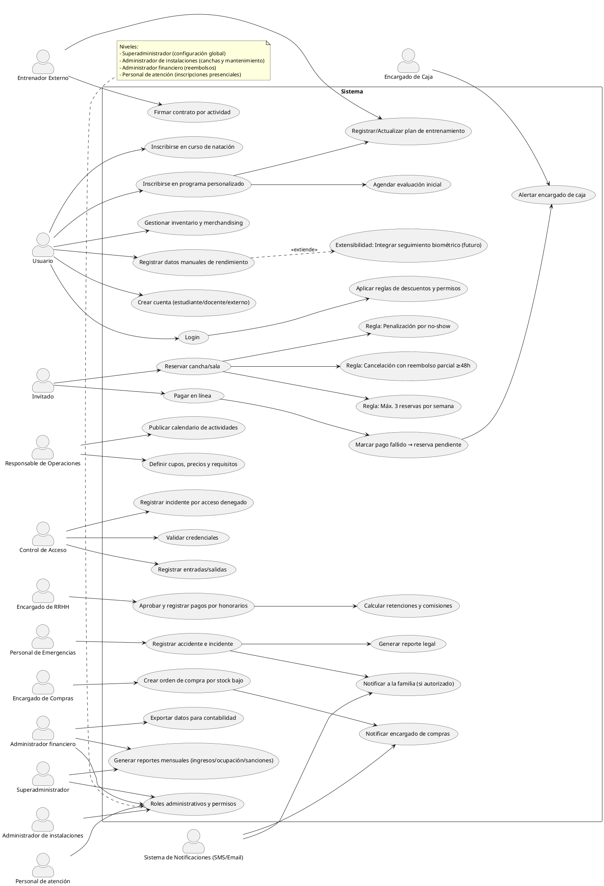

# Diagrama de Casos de Uso — Centro Deportivo Universitario "Areté"

PlantUML del diagrama completo (puedes renderizarlo con cualquier visor PlantUML):

Este diagrama resume los actores identificados y sus interacciones con los casos de uso del sistema, incluyendo reglas de negocio, notificaciones automáticas y módulos con posibilidad de extensibilidad (biométrico futuro).